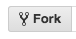

This project was bootstrapped with [Create React App](https://github.com/facebookincubator/create-react-app).
# Angular-React-Port
AngualrJS phone catalog app ported to ReactJS with Redux hosted at https://angular-to-react-port.herokuapp.com/

## What is it?
 A single page application built for learning and practicing ReactJS and Redux

## Features
 * Uses Redux for state management
 * Uses ReactJS as organizational framework
 * Supports item filtering
 * Supports item sorting

## Installation steps
 Please follow the steps below:

### Pre-requisites:
 * NodeJS for NPM - https://nodejs.org/en/download/
 * Any text editor for editing the code(Sublime text preferred - https://www.sublimetext.com/download/)
 * Git(Download - https://git-scm.com/downloads)

### Steps
 1. Download/ Fork(Find steps for forking in 'How to Contribute' section) this repository
 2. Navigate to the downloaded/forked directory with git
 3. Run the following commands on git:
      * npm install
      * npm start
 4. Note that Browser window opens and webpage is displayed

## Resources

* [Angular Tutorial](https://docs.angularjs.org/tutorial)
* [PhoneCat App](http://angular.github.io/angular-phonecat/step-14/app/#!/phones)
* [PhoneCat App on Github](https://github.com/angular/angular-phonecat/tree/step-14)
* [ReactJS documentation](https://reactjs.org/docs/)
* [Redux documentation](https://redux.js.org/basics)

## How to Contribute

Find any bugs? Have another feature you think should be included? Contributions are welcome!

First, fork this repository.



Next, clone this repository to your desktop to make changes.

```sh
$ git clone {YOUR_REPOSITORY_CLONE_URL}
$ cd folder
```

Once you've pushed changes to your local repository, you can issue a pull request by clicking on the green pull request icon.


## License

The contents of this repository are covered under the [MIT License](LICENSE).
